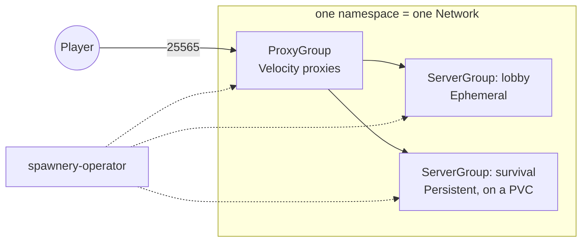

# Spawnery

[](https://github.com/spawnery/spawnery/actions/workflows/ci.yml)
[](https://github.com/spawnery/spawnery/releases)
[](LICENSE)

A Kubernetes-native cloud system for Minecraft networks.

Spawnery runs Paper game servers behind a Velocity proxy layer on Kubernetes —
dynamically scaling minigame and lobby groups as much as persistent survival
worlds. The target platform is RKE2 on bare metal, without ruling out other
distributions.

Servers are described in groups, not in pods:

```yaml
apiVersion: spawnery.cloud/v1alpha1
kind: ServerGroup
metadata:
  name: lobby
spec:
  networkRef: { name: production }
  type: Ephemeral
  maxPlayers: 100
  scaling:
    minReplicas: 1
    maxReplicas: 10
    spareSlots: 40      # how many free slots Spawnery keeps in reserve
```

Scaling follows free player slots rather than CPU, and a server with players is
never deleted: before it stops, its players are moved onto a fallback through
the proxy.

## How it works

Four custom resources, all namespaced. One namespace holds one `Network`, and a
`Network` is one trust domain — see [Choosing a game
namespace](https://docs.spawnery.cloud/getting-started/#choosing-a-game-namespace)
before you put two of anything in one.

| Kind | What it is |
|---|---|
| `Network` | One Minecraft network. Holds the Velocity forwarding secret and the defaults every group below it inherits. Exactly one per namespace. |
| `ServerGroup` | A set of Paper backends. `Ephemeral` ones scale on free player slots; `Persistent` ones are addressed by ordinal and keep their world on a PVC. |
| `ProxyGroup` | The Velocity proxies players connect to. Carries the expose strategy — `NodePort`, `LoadBalancer`, `HostPort` or `ClusterIP` — and the fallback groups a player is routed to. |
| `Server` | One backend, created by its group. You do not write these; you read them. |



The dotted lines are the part that is not ordinary Kubernetes. **Game pods never
read the Kubernetes API.** A plugin inside each Paper and Velocity process opens
one authenticated gRPC stream to the operator, identified by a pod-bound
ServiceAccount token, and that stream carries both directions: the agent reports
readiness and player counts up, the operator sends the server list, drain orders
and readiness changes down. It is what makes the two things above possible —
scaling on players the operator can actually count, and moving players off a
server before it stops rather than disconnecting them.

## Status

Running, and honest about where it stops. The operator, the game images and
the Helm chart are published to `ghcr.io/spawnery`, the chart as an OCI
artefact since v0.2.14 — this sentence had claimed it since 2026-08-27 and
through the eight releases from `v0.2.6` to `v0.2.13`, none of which published
a chart, while the install instructions below said "from a checkout" the whole
time. A licensed Minecraft client has joined through the proxy, been moved
onto a fallback while a server was taken away, and survived a rolling update
of the proxy fleet. The whole system installs and
runs on a three-node RKE2 cluster with Cilium, which is where the
`NetworkPolicy` objects were enforced for the first time.

What that cluster has not done is carry a real player: TCP 25565 does not
reach it from outside, so the joins above were all driven against local `kind`
clusters. The API is `v1alpha1` and is not stable.

The backend image is [Purpur](https://purpurmc.org) as of v0.2.15 —
`ghcr.io/spawnery/purpur`, a fork of Paper running the same agent, the same
entrypoint and the same Java runtime. `ghcr.io/spawnery/paper` is deprecated
and still published; nothing moves until a `ServerGroup`'s `spec.image` is
edited, and the [release
notes](docs/archive/release-notes.md#0215-purpur-is-the-backend-image-and-paper-is-deprecated)
carry what that costs.

Whatever is open right now is in
[`docs/reference/known-issues.md`](docs/reference/known-issues.md) — an entry
is deleted when it closes, so an empty file means nothing is open. How it got
here, milestone by milestone and with the measurement each claim rests on, is
[`docs/archive/history.md`](docs/archive/history.md).

## Install

The [tutorial](docs/tutorial/index.md) runs this same install on a local
`kind` cluster and ends with a player joining a server — start there if this
is your first run. To install directly:

```bash
helm install spawnery oci://ghcr.io/spawnery/charts/spawnery \
  --version 0.4.0 \
  --namespace spawnery-system --create-namespace
```

No checkout and no `helm repo add`: the chart is an OCI artefact beside the
three images. `--version` takes the chart's own number, which is not the
release tag and is not meant to be — `charts/spawnery/Chart.yaml` moves when
`charts/` does, which is neither every release nor only the ones that move the
operator. Every GitHub Release names the version to install in its body.

From a checkout — which is what the end-to-end run and every local test use —
it is `helm install spawnery charts/spawnery` with the same flags.

`--create-namespace` is not optional — the chart templates no `Namespace` of
its own on purpose. There is also **one manual step per game namespace** the
chart cannot make for you. Both are covered in
[Getting started](https://docs.spawnery.cloud/getting-started/), the full
installation reference.

[`config/samples/network.yaml`](config/samples/network.yaml) is a working
network to start from: a `Network`, an ephemeral lobby and one proxy group,
with every expose strategy written out as a commented alternative.

Running the game images accepts [Mojang's EULA](https://www.minecraft.net/eula)
on your behalf — the entrypoint writes `eula=true`, because Paper does not
start otherwise.

## Documentation

The full documentation — installing the chart, choosing a game namespace,
upgrading, the guides for persistent storage, plugins, mounts and CA/secret
rotation, and the milestone-by-milestone history — is at
[docs.spawnery.cloud](https://docs.spawnery.cloud). Everything open right now
is in [`docs/reference/known-issues.md`](docs/reference/known-issues.md), and
the project is licensed under [`LICENSE`](LICENSE).

## Development

```bash
nix develop
make test              # unit and envtest tests
make build             # bin/spawnery-operator
make agent             # both agent plugins and their JUnit suites
make e2e               # the driven run: the operator in a real kind cluster
```

Everything builds through Nix, so nothing depends on what is installed on the
machine. [`docs/contributing/development.md`](docs/contributing/development.md)
has the full target table, what each image target costs, how publishing works,
and the hand-driven flow for running the operator outside a local `kind`
cluster.

## License

Apache 2.0 — see [`LICENSE`](LICENSE).
