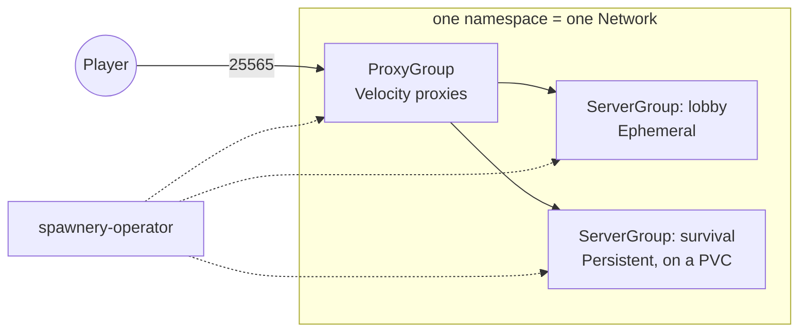

# Spawnery

A Kubernetes-native cloud system for Minecraft networks.

Spawnery runs Paper game servers behind a Velocity proxy layer on Kubernetes —
dynamically scaling minigame and lobby groups as much as persistent survival
worlds. The target platform is RKE2 on bare metal, without ruling out other
distributions.

The [tutorial](tutorial/index.md) takes an empty machine to a player standing
on a server, on a local `kind` cluster with 7-8Gi of memory free — the
fastest way to see it work before reading how it works.

Servers are described in groups, not in pods:

```yaml
apiVersion: spawnery.cloud/v1alpha1
kind: ServerGroup
metadata:
  name: lobby
spec:
  networkRef: { name: production }
  type: Ephemeral
  maxPlayers: 100
  scaling:
    minReplicas: 1
    maxReplicas: 10
    spareSlots: 40      # how many free slots Spawnery keeps in reserve
```

Scaling follows free player slots rather than CPU, and a server with players is
never deleted: before it stops, its players are moved onto a fallback through
the proxy.

## How it works

Four custom resources, all namespaced. One namespace holds one `Network`, and a
`Network` is one trust domain — see [Choosing a game
namespace](getting-started/index.md#choosing-a-game-namespace) before you
put two of anything in one.

| Kind | What it is |
|---|---|
| `Network` | One Minecraft network. Holds the Velocity forwarding secret and the defaults every group below it inherits. Exactly one per namespace. |
| `ServerGroup` | A set of Paper backends. `Ephemeral` ones scale on free player slots; `Persistent` ones are addressed by ordinal and keep their world on a PVC; `OnDemand` ones start nothing by themselves and are asked for by name, one player's private server each, with its own world on a PVC. |
| `ProxyGroup` | The Velocity proxies players connect to. Carries the expose strategy — `NodePort`, `LoadBalancer`, `HostPort` or `ClusterIP` — and the fallback groups a player is routed to. |
| `Server` | One backend, created by its group. You do not write these; you read them. |



The dotted lines are the part that is not ordinary Kubernetes. **Game pods never
read the Kubernetes API.** A plugin inside each Paper and Velocity process opens
one authenticated gRPC stream to the operator, identified by a pod-bound
ServiceAccount token, and that stream carries both directions: the agent reports
readiness and player counts up, the operator sends the server list, drain orders
and readiness changes down. It is what makes the two things above possible —
scaling on players the operator can actually count, and moving players off a
server before it stops rather than disconnecting them.

Whatever is open right now is in [Known issues](reference/known-issues.md) — an entry is
deleted when it closes, so an empty file means nothing is open.
